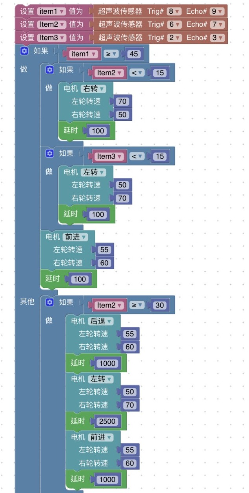

# 算法与程序
***
##迷宫算法
&emsp;&emsp;经过调研与讨论，小组一致认为迷宫的简单走法就是“扶着墙走”，因此我们希望设计合适的算法让小车始终靠右墙走直至走出迷宫。在这里因为所给迷宫入口在右端，因此我们的算法思想是：令小车行进间动作的优先级为前进>左转>右转，具体实现为：先取前方传感器传回的距离值(item1)，当item1>d1（d1为某一个临界值）时让小车保持前进，否则（即item1<=d1）再考虑左边传感器传回的距离值(item2)，当item2>d2（d2也为某一个临界值）时让小车执行左转，不然（即item2<=d2）让小车右转。

图7.程序流程图

##程序实现
由于迷宫每条路宽度为60cm，而小车宽度约为30cm，经过理论上的分析，我们将前方距离的临界值d1设为45，左边距离的临界值d2设为30，而转速和延时都暂定为默认值，分别为90和1000。

图8.初始Blockly程序

##理论与实际的差距
在小组实际搭建的如下迷宫场景中进行实验，我们发现了一系列算法和参数上的问题，经讨论后对其做了对应的改进和调整。

图9.小组自搭简易迷宫

###算法改进
* 转弯动作：小车转弯时出现了空间不够转了一半就碰墙了的情况，我们最直观的想法是将前方距离d1调大给小车足够的空间，但发现调大后传感器传回的距离值容易出现不稳定的情况，故我们考虑在每一个转弯前加上一个后退动作，留出足够的空间给小车转；  
* 小车直行时调整：由于万向轮的方向不定，小车直行时仍有偏差故容易走歪，故我们希望使小车保持与左右墙的距离都至少为d3来使小车尽量摆正，具体实现为：当左边传感器传回的距离值item2<d3时，小车做一小角度右转，当右边传感器传回的距离值item3<d3时，小车做一小角度左转。
###参数调整
* 距离：在实际操作中我们发现，前方传感器对距离的感知不够准确，当d1=45时会出现撞前墙和转弯过晚的情况，因此需将距离调大，经调整我们发现d1=60更切合小车改变动作时的时机，而小车与左右墙需保持的距离取d3=15时效果最佳；
* 轮速：由于小车左右轮转速为90时前进过快，小车来不及判断传感器传回的距离值就直接撞前墙，经试验我们将起调至适中的55，然后我们又发现左右轮实际转速不一导致小车不走直线，故我们再将反应稍慢的右轮转速相对地调大了5，即左轮转速55，右轮转速60；
* 延时：因为在延时内小车会保持前一动作，一开始延时默认为1000时判断前方传感器传回的距离值过晚，导致小车未执行转弯动作直接撞墙，因此我们将前进延时减为100，而在转弯动作执行时，延时过高会导致转弯的角度过大，因此我们经过反复实验又重新调整了转弯动作（包括后退和转弯）的延时，分别为1000和2500。
###程序修正
鉴于以上算法改进和参数调整，我们对Blockly程序做了对应修正。

图10-11.修正后的Blockly程序

我们希望实现小车在迷宫中的运动轨迹如下图：

图12.预期结果

