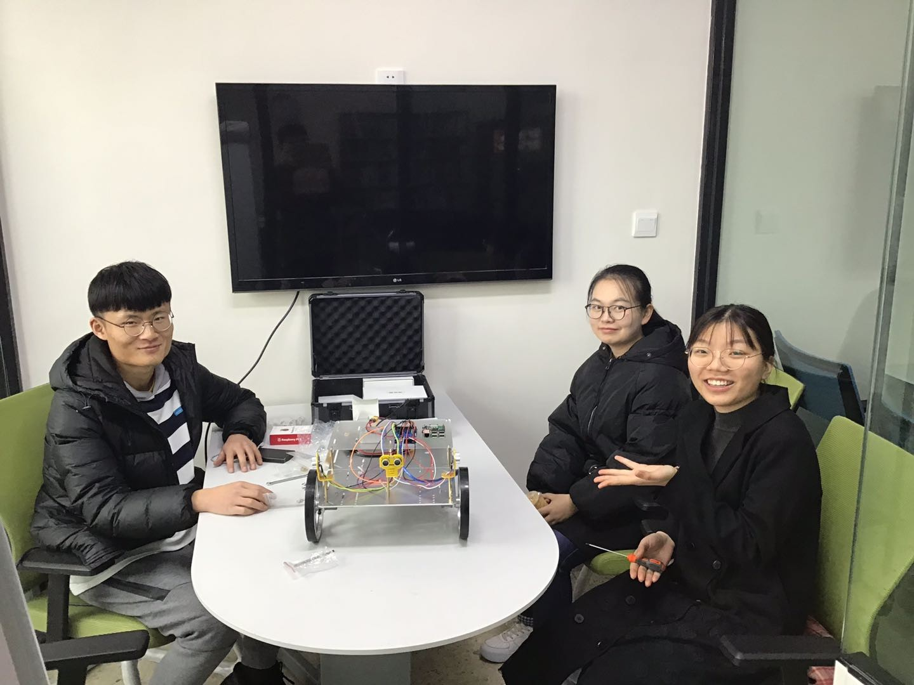
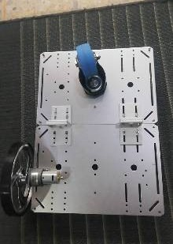
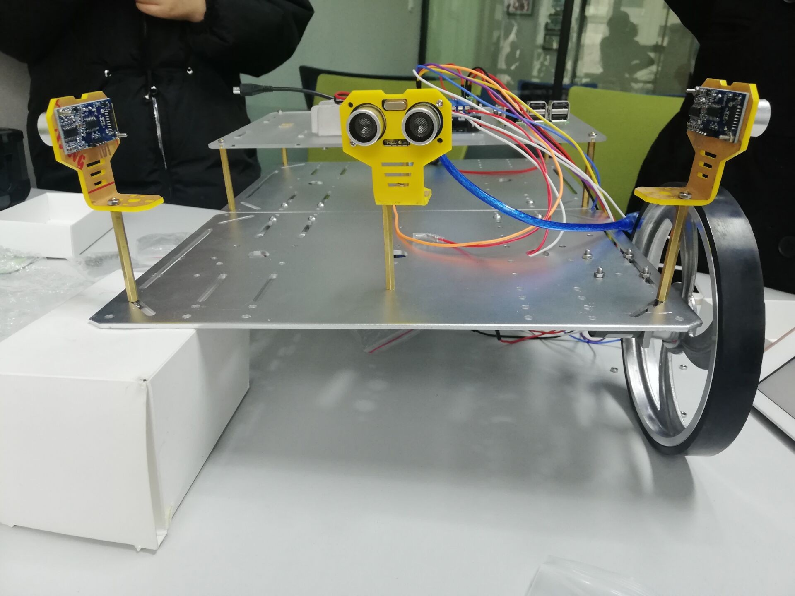
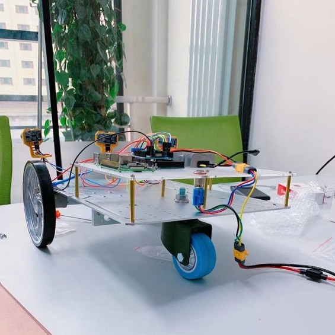
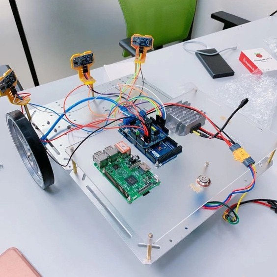
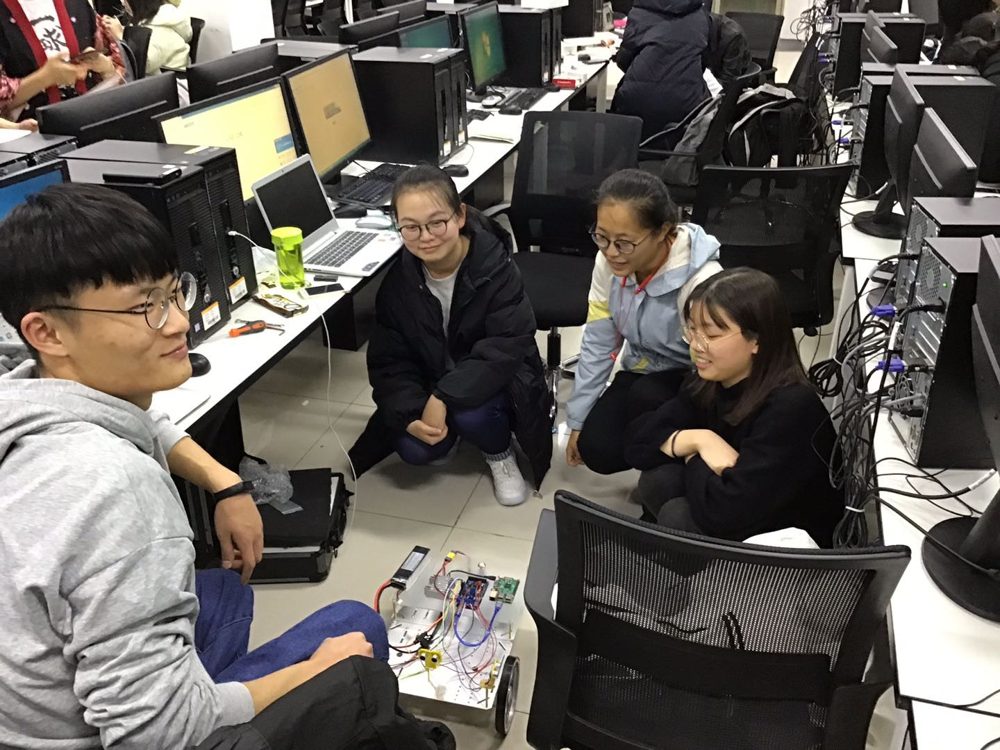

# 小车安装
***
本小组机器小车的组装按照指导手册进行,耗时约4小时。

图1.小组成员在2019年11月30号上午于观云楼八楼讨论室进行了小车的组装

整个小车组装过程主要按照以下步骤进行:  
1. 连接A、B板作为小车底板；  
2. 底板安装电机和车轮；  

图2.安装车轮

3. 底板安装铜柱；  
4. 在亚克力板上安装电路板；  
5. 将亚克力板安装在底板的铜柱上；  
6. 连接电机；  
7. 安装并连接超声波传感器。  

&emsp;&emsp;组装过程是对动手能力和观察能力的锻炼，每一个细节都需要倾注心思。让每一个部件出现在正确的位置并以正确的方式同其他部件相连才能完成整个组装过程。我们在组装过程中遇到了许多问题，诸如缺少零部件、部件固定方式不对、线路连接错误等等，最后都在大家齐心协力下被一一解决了。

图3.安装过程中小车缺少一个发动机

图4.组装中的小车1

图5.组装中的小车2

&emsp;&emsp;小车安装完成后，我们接通电源进行了线路检查，以确保小车可以正常启动，然后设计简单的程序检查信号传输是否顺利，并进行初步的调试。

图6.调试小车

