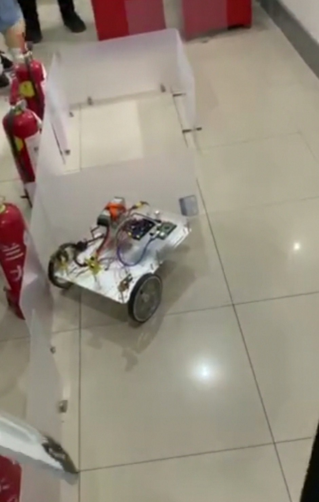

# 迷宫比赛
***
##前期准备
小组成员周末多次约见讨论，在讨论过程中，大家各抒己见，最终确定了小车走迷宫的算法，但在不断的调试与上传过程中，小车对于算法的执行情况一直让人有些失望，而且也不难发现由于小车轮胎与不同地面之间的摩擦系数有所不同，我们需要针对不同的路面调整转速才能让小车正常稳定的前进。最终在调试还未结束时小车电量耗尽，调试被迫结束。

图13.在自搭迷宫中调整小车

##现场调整
在比赛开始前，我们针对比赛路面将转速进行了调整，但小车在转向时依旧存在转角不对的问题，我们从多个方面对小车进行的紧急调整，也怀疑过可能又是传感器等小车部件出现问题，多次请教老师，老师也都耐心解答，并且让我们更换了一次小车传感器，甚至最终直接借用冠军队的小车来执行我们设计的程序，但最终仍未成功走出迷宫。

图14.现场紧急更换传感器

##比赛结果
第一次尝试勉勉强强到达70分点，第二次尝试和第三次尝试均以失败告终，感谢每一位组员的辛勤付出，虽说成绩不是很理想，但我们已经都知足了，况且与我们在准备比赛的过程中收获到的东西已经远远比比赛结果更加重要了。

图15.迷宫比赛进行中
